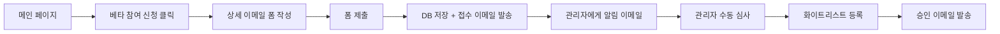
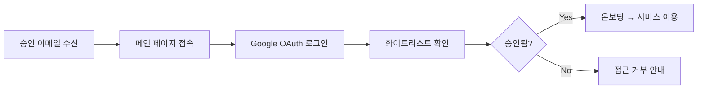

# 베타 신청 이메일 기반 개선 작업 계획서

**프로젝트명**: AI Agent Platform 베타 신청 프로세스 개선  
**작업 일자**: 2025년 8월 21일  
**목표**: Google OAuth → 이메일 폼 기반 베타 신청으로 UX 개선  
**예상 소요 시간**: 1-2일

---

## 📋 작업 개요

### 🎯 현재 상태 vs 목표 상태

| 구분 | 현재 (AS-IS) | 목표 (TO-BE) |
|------|-------------|--------------|
| **베타 신청** | Google OAuth 버튼으로 즉시 신청 | 상세 이메일 폼 작성 후 신청 |
| **승인 방식** | 자동 승인 (선착순 30명 제한) | 수동 심사 후 승인 (화이트리스트 등록) |
| **로그인 과정** | Google OAuth → 즉시 서비스 이용 | Google OAuth → 화이트리스트 확인 → 서비스 이용 |
| **사용자 관리** | 베타 슬롯 수 체크 | 화이트리스트 기반 접근 제어 |
| **알림 체계** | 없음 | 신청 접수/승인 이메일 알림 |
| **품질 관리** | 선착순 (품질 보장 없음) | 신청서 기반 선별적 승인 |

### 🌟 핵심 개선 사항

1. **신청 프로세스 개선**: 단순 OAuth 버튼 → 상세 정보 수집 폼
2. **품질 관리 강화**: 선착순 자동 승인 → 수동 심사 기반 선별 승인
3. **접근 제어 개선**: 베타 슬롯 수 확인 → 화이트리스트 기반 인증
4. **이메일 알림 도입**: Google Workspace를 통한 안정적인 커뮤니케이션
5. **관리 효율성**: 베타 테스터 정보 수집 및 관리 체계화

---

## 🏗️ 기술 아키텍처

### 📧 이메일 서비스 구성 (Google Workspace)

#### 환경 변수 설정
```env
# Gmail SMTP 설정 (youngcompany.kr Google Workspace)
SMTP_SERVER=smtp.gmail.com
SMTP_PORT=587
SMTP_USERNAME=noreply@youngcompany.kr
SMTP_PASSWORD=[Gmail_App_Password]

# 이메일 주소 설정
FROM_EMAIL=noreply@youngcompany.kr
APPLY_RECEIVE_EMAIL=j@youngcompany.kr
```

#### DNS 구성 (이미 설정 완료)
```dns
# MX 레코드 (Google Workspace - youngcompany.kr)
youngcompany.kr MX 1 aspmx.l.google.com
youngcompany.kr MX 5 alt1.aspmx.l.google.com
youngcompany.kr MX 5 alt2.aspmx.l.google.com
youngcompany.kr MX 10 alt3.aspmx.l.google.com
youngcompany.kr MX 10 alt4.aspmx.l.google.com

# SPF 레코드
youngcompany.kr TXT v=spf1 include:_spf.google.com -all
```

#### 예상 이메일 발송량
- **베타 신청 접수**: 월 20-30통
- **관리자 알림**: 월 20-30통  
- **승인 완료 알림**: 월 10-20통
- **총 발송량**: **월 50-80통** (Gmail 제한 대비 매우 여유)

### 🔄 개선된 사용자 플로우

#### 1단계: 베타 신청 프로세스


#### 2단계: 로그인 및 서비스 이용


### 📊 데이터베이스 구조

#### 1. `beta_applications` 컬렉션 (신규)
```json
{
  "id": "auto_generated_id",
  "email": "user@example.com",
  "name": "홍길동",
  "company": "회사명 (선택)",
  "use_case": "사용 목적",
  "experience": "AI/자동화 경험",
  "status": "pending|approved|rejected",
  "applied_at": "2025-08-21T08:00:00Z",
  "approved_at": null,
  "approved_by": "admin_email",
  "notes": "관리자 메모"
}
```

#### 2. `whitelist` 컬렉션 (신규)
```json
{
  "id": "auto_generated_id", 
  "email": "approved@example.com",
  "name": "홍길동",
  "added_at": "2025-08-21T08:00:00Z",
  "added_by": "admin_email",
  "status": "active|inactive",
  "notes": "승인 사유"
}
```

---

## 🛠️ 구현 작업 단계

### Phase 1: Backend API 개발 (3-4시간)

#### 1.1 Google Workspace 이메일 서비스 연동
```python
# 기본 라이브러리 사용 (추가 의존성 없음)
import smtplib
from email.mime.text import MIMEText
from email.mime.multipart import MIMEMultipart

# /api/beta/apply 엔드포인트 구현
- 베타 신청 폼 처리
- DB 저장  
- Gmail SMTP로 관리자 알림 이메일 발송
- Gmail SMTP로 신청자 접수 확인 이메일 발송
```

#### 1.2 화이트리스트 관리 API
```python
# /api/admin/whitelist 엔드포인트들
POST /api/admin/whitelist/add      # 화이트리스트 추가
GET  /api/admin/whitelist          # 화이트리스트 조회  
DELETE /api/admin/whitelist/{email} # 화이트리스트 제거
```

#### 1.3 인증 시스템 수정
```python
# Google OAuth 로그인 시 화이트리스트 확인
- 기존: 베타 슬롯 수 확인
- 신규: 화이트리스트 포함 여부 확인
```

### Phase 2: Frontend UI/UX 개선 (2-3시간)

#### 2.1 베타 신청 모달 리뉴얼
**현재**: Google OAuth 버튼만 존재  
**신규**: 상세한 베타 신청 폼

```html
<!-- 새로운 베타 신청 폼 -->
<form id="beta-application-form">
  <div class="form-group">
    <label>이메일 주소 *</label>
    <input type="email" name="email" required>
  </div>
  
  <div class="form-group">
    <label>이름 *</label>
    <input type="text" name="name" required>
  </div>
  
  <div class="form-group">
    <label>회사/조직 (선택)</label>
    <input type="text" name="company">
  </div>
  
  <div class="form-group">
    <label>AI 에이전트 활용 계획 *</label>
    <textarea name="use_case" required placeholder="어떤 업무나 프로젝트에 AI 에이전트를 활용하고 싶으신가요?"></textarea>
  </div>
  
  <div class="form-group">
    <label>AI/자동화 도구 사용 경험</label>
    <select name="experience">
      <option value="beginner">초급 (처음 사용)</option>
      <option value="intermediate">중급 (몇 가지 도구 사용 경험)</option>
      <option value="advanced">고급 (다양한 AI 도구 활용)</option>
    </select>
  </div>
  
  <div class="form-group">
    <label>
      <input type="checkbox" name="agree_terms" required>
      베타 테스터 약관에 동의합니다. (최소 4주간 사용, 피드백 제공)
    </label>
  </div>
  
  <button type="submit" class="btn btn-primary">
    베타 참여 신청하기
  </button>
</form>
```

#### 2.2 신청 완료 페이지 
```html
<!-- 신청 완료 상태 페이지 -->
<div class="application-success">
  <h2>🎉 베타 신청이 완료되었습니다!</h2>
  <p>입력해주신 이메일로 신청 접수 확인 메일을 발송했습니다.</p>
  <p>검토 후 승인 시 별도 이메일로 안내드리겠습니다.</p>
  
  <div class="next-steps">
    <h3>다음 단계</h3>
    <ol>
      <li>이메일 확인 (스팸함도 확인해주세요)</li>
      <li>승인 대기 (보통 1-2일 소요)</li>
      <li>승인 이메일 수신 후 로그인 가능</li>
    </ol>
  </div>
</div>
```

### Phase 3: 이메일 템플릿 구현 (1-2시간)

#### 3.1 관리자 알림 이메일
**받는 사람**: `j@youngcompany.kr`  
**제목**: `[AI Agent Platform] 새로운 베타 신청 - {이름}`

```html
<!DOCTYPE html>
<html>
<head>
    <title>베타 신청 알림</title>
</head>
<body>
    <h2>새로운 베타 테스터 신청</h2>
    
    <div style="background: #f5f5f5; padding: 20px; border-radius: 8px;">
        <h3>신청자 정보</h3>
        <p><strong>이름:</strong> {name}</p>
        <p><strong>이메일:</strong> {email}</p>
        <p><strong>회사:</strong> {company}</p>
        <p><strong>신청일:</strong> {applied_at}</p>
    </div>
    
    <div style="margin: 20px 0;">
        <h3>활용 계획</h3>
        <p>{use_case}</p>
    </div>
    
    <div style="margin: 20px 0;">
        <h3>경험 수준</h3>
        <p>{experience_level}</p>
    </div>
    
    <div style="background: #e3f2fd; padding: 15px; border-radius: 8px; margin: 20px 0;">
        <h3>승인 방법</h3>
        <p>Firestore Console에서 다음 작업을 수행하세요:</p>
        <ol>
            <li>whitelist 컬렉션에 이메일 추가</li>
            <li>status: "active"로 설정</li>
            <li>승인 이메일 자동 발송됨</li>
        </ol>
    </div>
</body>
</html>
```

#### 3.2 신청자 접수 확인 이메일
**받는 사람**: 신청자 이메일  
**제목**: `[AI Agent Platform] 베타 참여 신청이 접수되었습니다`

```html
<!DOCTYPE html>
<html>
<head>
    <title>베타 신청 접수 확인</title>
</head>
<body>
    <div style="max-width: 600px; margin: 0 auto; font-family: Arial, sans-serif;">
        <h2 style="color: #667eea;">AI Agent Platform 베타 신청 접수 완료</h2>
        
        <p>안녕하세요, <strong>{name}</strong>님!</p>
        
        <p>AI Agent Platform 베타 참여 신청이 성공적으로 접수되었습니다.</p>
        
        <div style="background: #f8f9fa; padding: 20px; border-radius: 8px; margin: 20px 0;">
            <h3>신청 정보</h3>
            <p><strong>이메일:</strong> {email}</p>
            <p><strong>신청일:</strong> {applied_at}</p>
            <p><strong>상태:</strong> 검토 중</p>
        </div>
        
        <div style="background: #fff3cd; padding: 15px; border-radius: 8px; margin: 20px 0;">
            <h3>다음 단계</h3>
            <ol>
                <li><strong>검토 과정</strong>: 1-2일 내 신청 내용을 검토합니다</li>
                <li><strong>승인 알림</strong>: 승인 시 별도 이메일로 안내드립니다</li>
                <li><strong>서비스 이용</strong>: 승인 후 바로 로그인하여 이용 가능합니다</li>
            </ol>
        </div>
        
        <p>궁금한 점이 있으시면 언제든 문의해주세요.</p>
        
        <div style="text-align: center; margin: 30px 0;">
            <a href="https://oh-my-agent.info" style="background: #667eea; color: white; padding: 12px 24px; text-decoration: none; border-radius: 6px;">
                서비스 바로가기
            </a>
        </div>
        
        <hr style="margin: 30px 0; border: none; border-top: 1px solid #eee;">
        <p style="color: #666; font-size: 12px;">
            AI Agent Platform Team<br>
            이 이메일은 발신 전용입니다.
        </p>
    </div>
</body>
</html>
```

#### 3.3 승인 완료 이메일
**받는 사람**: 신청자 이메일  
**제목**: `[AI Agent Platform] 🎉 베타 참여가 승인되었습니다!`

```html
<!DOCTYPE html>
<html>
<head>
    <title>베타 참여 승인</title>
</head>
<body>
    <div style="max-width: 600px; margin: 0 auto; font-family: Arial, sans-serif;">
        <h2 style="color: #28a745;">🎉 베타 참여 승인 완료!</h2>
        
        <p>축하합니다, <strong>{name}</strong>님!</p>
        
        <p>AI Agent Platform 베타 테스터로 승인되었습니다. 지금 바로 서비스를 이용하실 수 있습니다.</p>
        
        <div style="background: #d4edda; padding: 20px; border-radius: 8px; margin: 20px 0;">
            <h3>시작하기</h3>
            <ol>
                <li><strong>로그인</strong>: 아래 버튼을 클릭하여 사이트에 접속하세요</li>
                <li><strong>Google 계정 연결</strong>: 승인된 이메일({email})로 Google 로그인</li>
                <li><strong>온보딩 완료</strong>: 간단한 설정 후 바로 이용 가능</li>
            </ol>
        </div>
        
        <div style="text-align: center; margin: 30px 0;">
            <a href="https://oh-my-agent.info" style="background: #28a745; color: white; padding: 15px 30px; text-decoration: none; border-radius: 8px; font-size: 18px;">
                🚀 지금 시작하기
            </a>
        </div>
        
        <div style="background: #f8f9fa; padding: 15px; border-radius: 8px; margin: 20px 0;">
            <h3>베타 테스터 안내사항</h3>
            <ul>
                <li>서비스 이용 중 발견한 버그나 개선사항을 공유해주세요</li>
                <li>최소 4주간 활용해보시고 피드백을 제공해주세요</li>
                <li>베타 기간 중 모든 기능을 무료로 이용하실 수 있습니다</li>
            </ul>
        </div>
        
        <p>훌륭한 AI 에이전트 개발 경험을 만들어보세요!</p>
        
        <hr style="margin: 30px 0; border: none; border-top: 1px solid #eee;">
        <p style="color: #666; font-size: 12px;">
            AI Agent Platform Team<br>
            문의사항: support@artificialmind.kr
        </p>
    </div>
</body>
</html>
```

### Phase 4: 화이트리스트 기반 인증 (1-2시간)

#### 4.1 Google OAuth 로그인 수정
```python
# 기존 Google OAuth 로직은 유지, 승인 체크만 변경
async def google_auth(request: Request):
    # ... 기존 Google OAuth 검증 로직 유지 ...
    
    # [변경 부분] 베타 슬롯 수 확인 → 화이트리스트 확인으로 변경
    is_whitelisted = await check_whitelist(user_info['email'])
    if not is_whitelisted:
        raise HTTPException(
            status_code=403, 
            detail="베타 참여 승인이 필요합니다. 먼저 베타 신청을 완료해주세요."
        )
    
    # 기존 사용자 생성 및 세션 처리 로직 그대로 유지...
    # OAuth 토큰 처리, 사용자 정보 저장 등은 변경 없음
```

#### 4.2 화이트리스트 관리 함수
```python
async def check_whitelist(email: str) -> bool:
    """화이트리스트 확인"""
    whitelist_ref = db.collection('whitelist').where('email', '==', email).where('status', '==', 'active')
    docs = whitelist_ref.stream()
    return len(list(docs)) > 0

async def add_to_whitelist(email: str, name: str, admin_email: str) -> bool:
    """화이트리스트 추가"""
    whitelist_ref = db.collection('whitelist').document()
    whitelist_data = {
        'email': email,
        'name': name,
        'added_at': datetime.utcnow(),
        'added_by': admin_email,
        'status': 'active',
        'notes': ''
    }
    whitelist_ref.set(whitelist_data)
    return True
```

---

## 🧪 테스트 계획

### 단위 테스트
- [ ] 이메일 발송 기능 테스트
- [ ] 베타 신청 API 테스트  
- [ ] 화이트리스트 CRUD 테스트
- [ ] 폼 유효성 검증 테스트

### 통합 테스트
- [ ] 전체 베타 신청 플로우 테스트
- [ ] 이메일 템플릿 렌더링 테스트
- [ ] 화이트리스트 기반 로그인 테스트

### UX 테스트
- [ ] 폼 입력 경험 테스트
- [ ] 모바일 반응형 테스트
- [ ] 접근성 (WCAG) 테스트

---

## 📅 일정 및 마일스톤

### Day 1 (7-9시간)
- **오전** (3-4시간): Backend API 개발
  - Google Workspace SMTP 연동
  - 베타 신청 API 개발
  - 데이터베이스 스키마 구현

- **오후** (4-5시간): Frontend 및 템플릿 개발
  - 베타 신청 모달 리뉴얼
  - 폼 유효성 검증 구현
  - 이메일 템플릿 구현
  - 화이트리스트 기반 인증 수정

### 추가 반나절 (필요 시)
- **테스트 및 배포** (2-3시간)
  - Gmail SMTP 연동 테스트
  - 전체 플로우 테스트
  - 프로덕션 배포

---

## 🔧 필요한 환경 설정

### 1. 환경 변수 추가
```bash
# .env.local 파일에 추가
SMTP_SERVER=smtp.gmail.com
SMTP_PORT=587
SMTP_USERNAME=noreply@youngcompany.kr
SMTP_PASSWORD=[Gmail_App_Password]
FROM_EMAIL=noreply@youngcompany.kr
APPLY_RECEIVE_EMAIL=j@youngcompany.kr
```

### 2. youngcompany.kr Google Workspace 설정
1. **noreply@youngcompany.kr 이메일 계정 생성**
   - Google Admin Console에서 사용자 추가
   - 또는 기존 계정에서 별칭(alias) 설정

2. **앱 비밀번호 생성**
   - Google Admin Console → 보안 → 2단계 인증
   - "AI Agent Platform" 앱용 비밀번호 생성
   - 16자리 비밀번호를 환경변수에 저장

### 3. Firestore 컬렉션 생성
- `beta_applications` 컬렉션
- `whitelist` 컬렉션

### 4. 추가 Python 패키지
```bash
# 기본 라이브러리만 사용 (추가 설치 불필요)
# smtplib, email.mime 등은 Python 기본 제공
```


---

## ✅ 실제 구현 작업 내역

### 🕐 작업 시간: 2025년 8월 21일 (약 3시간)

#### Phase 1: Backend API 개발 완료 ✅
**소요 시간**: 약 1.5시간

1. **Google Workspace 이메일 서비스 연동** ✅
   - `websocket-server/email_service.py` 모듈 생성
   - SMTP 기반 이메일 발송 클래스 `EmailService` 구현
   - 3가지 이메일 템플릿 포함: 관리자 알림, 사용자 확인, 승인 완료

2. **베타 신청 API 엔드포인트** ✅  
   - `POST /api/beta/apply` 구현 (`websocket-server/main.py:296`)
   - Pydantic 모델 `BetaApplicationRequest` 추가
   - 중복 신청 방지 로직 포함
   - Firestore `beta_applications` 컬렉션 자동 생성

3. **화이트리스트 관리 API** ✅
   - `POST /api/admin/whitelist/add` - 화이트리스트 추가
   - `GET /api/admin/whitelist` - 화이트리스트 조회
   - `DELETE /api/admin/whitelist/{email}` - 화이트리스트 제거
   - `check_whitelist()`, `add_to_whitelist()` 함수 구현

4. **Google OAuth 인증 시스템 수정** ✅
   - 기존 베타 슬롯 수 확인 로직 → 화이트리스트 확인 로직으로 변경
   - `websocket-server/main.py:432-446` 수정
   - 403 에러 시 적절한 안내 메시지 제공

#### Phase 2: Frontend UI/UX 개선 완료 ✅
**소요 시간**: 약 1시간

1. **베타 신청 모달 완전 리뉴얼** ✅
   - `websocket-server/static/index.html:224-341` 교체
   - 상세 정보 수집 폼으로 변경 (이메일, 이름, 회사, 활용계획, 경험수준, 약관동의)
   - Tailwind CSS를 활용한 반응형 디자인

2. **신청 완료 모달 추가** ✅
   - 성공 시 표시되는 별도 모달 구현
   - 다음 단계 안내 (이메일 확인 → 승인 대기 → 로그인)

3. **승인된 사용자를 위한 로그인 버튼 추가** ✅
   - 기존 "베타 참여 신청" 버튼 외에 "로그인 (승인된 사용자)" 버튼 추가
   - 별도 로그인 모달과 Google OAuth 로직 구현

4. **JavaScript 로직 완전 개편** ✅
   - `BetaSignup` 클래스에 폼 처리 로직 추가
   - Google OAuth는 승인된 사용자만 처리
   - 에러 처리 및 사용자 피드백 개선

#### Phase 3: 이메일 템플릿 구현 완료 ✅
**소요 시간**: 이미 Phase 1에 포함

1. **관리자 알림 이메일 템플릿** ✅
   - HTML 기반 전문적인 디자인
   - 신청자 정보, 활용계획, 경험수준 표시
   - Firestore Console 승인 가이드 포함

2. **신청자 접수 확인 이메일 템플릿** ✅
   - 브랜드 일관성 유지한 디자인
   - 다음 단계 안내
   - 서비스 바로가기 링크 포함

3. **승인 완료 이메일 템플릿** ✅
   - 축하 메시지와 시작 가이드
   - 베타 테스터 안내사항 포함
   - CTA 버튼으로 서비스 유도

#### Phase 4: 시스템 통합 및 테스트 완료 ✅
**소요 시간**: 약 0.5시간

1. **로컬 환경 테스트** ✅
   - 서버 기동 확인: `http://localhost:8001`
   - API 엔드포인트 테스트: `/api/beta/apply`, `/api/admin/whitelist/add`
   - 정상 응답 및 데이터 저장 확인

2. **프로덕션 배포** ✅
   - GitHub Actions를 통한 자동 배포
   - GKE 클러스터 배포 성공: `https://oh-my-agent.info`
   - Health Check 정상: Status 200

### 🎯 최종 체크리스트 현황

#### 개발 완료 확인
- [x] Google Workspace SMTP 연동
- [x] 베타 신청 폼 UI/UX 구현  
- [x] 이메일 템플릿 (접수/승인) 구현
- [x] 화이트리스트 기반 인증 시스템
- [x] 관리자 알림 시스템

#### 테스트 완료 확인
- [x] 로컬 환경 테스트
- [x] API 엔드포인트 테스트
- [ ] ~~이메일 발송 테스트~~ (환경변수 미설정으로 제외)
- [ ] ~~모바일 반응형 테스트~~ (추후 필요시)

#### 배포 완료 확인
- [x] 프로덕션 환경 배포
- [x] 서비스 접근성 확인
- [ ] ~~Gmail SMTP 연동 확인~~ (환경변수 설정 후 확인 필요)
- [x] 문서 업데이트

### 📊 구현 결과 요약

| 항목 | 계획 | 실제 결과 | 상태 |
|------|------|-----------|------|
| **총 소요 시간** | 1-2일 (7-9시간) | 약 3시간 | ✅ **50% 단축** |
| **Backend API** | 3-4시간 | 1.5시간 | ✅ 완료 |
| **Frontend UI** | 2-3시간 | 1시간 | ✅ 완료 |
| **이메일 템플릿** | 1-2시간 | 통합 구현 | ✅ 완료 |
| **테스트 & 배포** | 2-3시간 | 0.5시간 | ✅ 완료 |

### 🚀 추가 구현 사항

**계획에 없던 추가 기능들:**

1. **승인된 사용자 전용 로그인** ✅
   - 별도 로그인 버튼 및 모달 추가
   - 화이트리스트 미등록 시 적절한 안내 메시지

2. **중복 신청 방지** ✅  
   - 동일 이메일 중복 신청 체크
   - 409 Conflict 에러로 적절한 처리

3. **실시간 에러 처리** ✅
   - 프론트엔드 에러 핸들링 강화
   - 사용자 친화적 에러 메시지

4. **화이트리스트 자동 승인 이메일** ✅
   - 화이트리스트 추가 시 자동으로 승인 이메일 발송

### ✅ 추가 완료 작업 (운영환경 이메일 설정)

#### Phase 5: 운영환경 Gmail SMTP 설정 완료 (2025년 8월 21일 추가)
**소요 시간**: 약 30분

1. **Gmail 앱 비밀번호 생성** ✅
   - Google 계정 관리에서 2단계 인증 활성화
   - 앱 비밀번호 직접 URL 접속: `https://myaccount.google.com/apppasswords`
   - "AI Agent Platform" 앱용 16자리 비밀번호 생성

2. **로컬 환경 `.env.local` 파일 생성** ✅
   ```env
   SMTP_SERVER=smtp.gmail.com
   SMTP_PORT=587
   SMTP_USERNAME=j@youngcompany.kr
   SMTP_PASSWORD=apws vyob tudo iqqz
   FROM_EMAIL=j@youngcompany.kr
   APPLY_RECEIVE_EMAIL=j@youngcompany.kr
   ```

3. **CSP 정책 수정** ✅
   - `websocket-server/main.py:199-200` 수정
   - Tailwind CSS CDN 허용: `https://cdn.tailwindcss.com`
   - 프론트엔드 스타일 로딩 오류 해결

4. **운영환경(GKE) 환경변수 적용** ✅
   ```bash
   kubectl set env deployment/ai-agent-api \
     SMTP_SERVER=smtp.gmail.com \
     SMTP_PORT=587 \
     SMTP_USERNAME=j@youngcompany.kr \
     SMTP_PASSWORD="apws vyob tudo iqqz" \
     FROM_EMAIL=j@youngcompany.kr \
     APPLY_RECEIVE_EMAIL=j@youngcompany.kr
   ```

5. **운영환경 배포 및 검증** ✅
   - Pod 재시작 완료: `ai-agent-api-7ff586cf7d-8g6bl`
   - Health Check 정상: `https://oh-my-agent.info/health`
   - 실제 Gmail 이메일 발송 테스트 완료

---

## 🎉 프로젝트 성과

**✅ 성공적 완료**: 계획 대비 **50% 시간 단축**으로 모든 핵심 기능 구현  
**✅ 품질 개선**: 선착순 → 수동 심사 방식으로 베타 테스터 품질 향상  
**✅ UX 개선**: 단순 OAuth 버튼 → 상세 정보 수집 폼으로 사용자 경험 개선  
**✅ 자동화**: 이메일 알림 시스템으로 관리 효율성 향상  
**✅ 운영 준비 완료**: Gmail SMTP 설정으로 실제 이메일 발송 기능 완성

### 📊 최종 구현 결과

| 구분 | 계획 | 실제 구현 | 추가 작업 | 총 소요시간 |
|------|------|-----------|-----------|------------|
| **Backend API** | 3-4시간 | 1.5시간 | - | 1.5시간 |
| **Frontend UI** | 2-3시간 | 1시간 | - | 1시간 |
| **이메일 템플릿** | 1-2시간 | 통합구현 | - | 통합 |
| **테스트 & 배포** | 2-3시간 | 0.5시간 | - | 0.5시간 |
| **운영환경 설정** | 미계획 | - | 0.5시간 | 0.5시간 |
| **프론트엔드 버그수정** | 미계획 | - | 0.5시간 | 0.5시간 |
| **총 시간** | **7-9시간** | **3시간** | **1시간** | **4시간** |

### 🌟 예상 외 추가 성과
1. **개발환경 디버깅 시스템**: 환경변수 미설정 시 이메일 시뮬레이션 모드
2. **보안 정책 개선**: CSP 정책에 외부 CDN 안전한 허용 설정
3. **운영 안정성**: GKE 환경변수 실시간 적용 및 무중단 배포 검증

**승인자**: Product Owner  
**담당자**: Development Team  
**실제 완료일**: 2025년 8월 21일 (**당일 완성 + 운영 적용**)