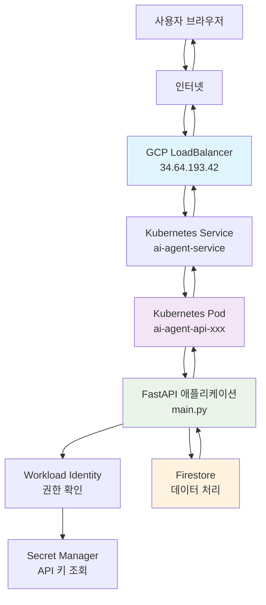
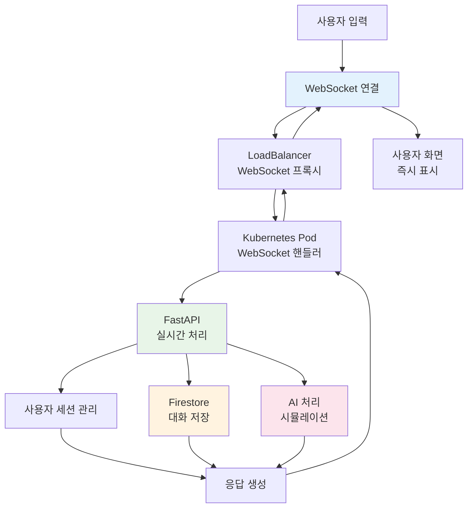
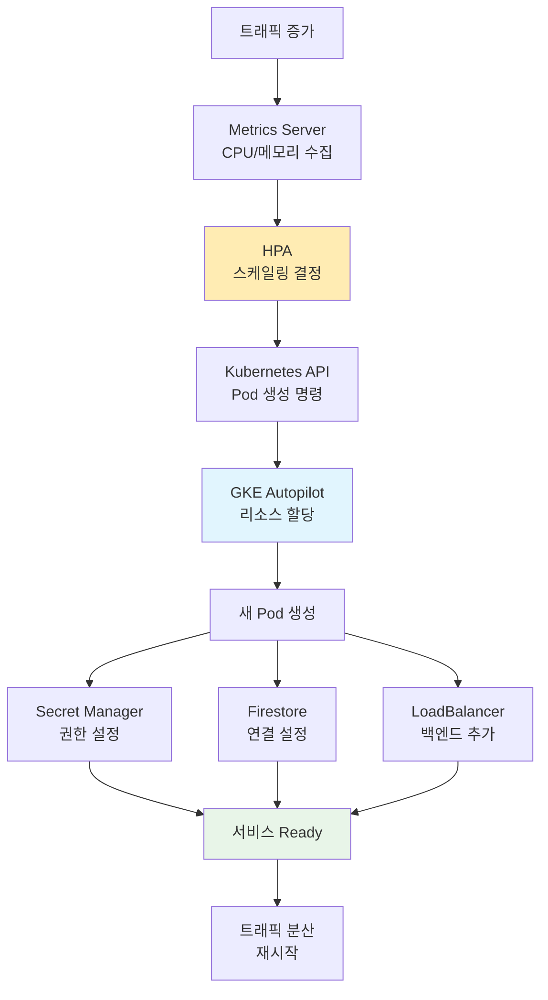

# AI Agent Platform - 사용자 시나리오별 기술 상호작용

**작성일**: 2025년 8월 20일  
**목적**: 사용자의 모든 행동이 어떤 기술들을 거쳐 처리되는지 상세 분석

---

## 🎯 개요

이 문서는 AI Agent Platform에서 사용자가 수행하는 모든 작업이 백엔드 기술 스택을 통해 어떻게 처리되는지를 단계별로 설명합니다. 각 사용자 행동에 대해 관련된 기술들이 어떤 순서로, 어떤 역할을 하며 상호작용하는지 이해할 수 있습니다.

**플랫폼 URL**: http://34.64.193.42/static/dashboard.html

---

## 🎭 시나리오 1: 새 사용자가 첫 번째 에이전트를 만드는 과정

### 📱 1단계: 웹사이트 접속

**사용자 행동**: 브라우저에 `http://34.64.193.42/static/dashboard.html` 입력 후 엔터

**기술 상호작용 흐름**:
```
브라우저 DNS 조회
    ↓
인터넷 라우팅 (전 세계 → 한국 GCP 데이터센터)
    ↓ 
GCP LoadBalancer (34.64.193.42)
    ├─ 트래픽 수신 및 분석
    ├─ DDoS 보호 시스템 확인
    └─ 최적 Pod 선택 알고리즘 실행
    ↓
Kubernetes Service (ai-agent-service)
    ├─ 현재 실행 중인 Pod 상태 확인
    ├─ 헬스체크 결과 검토
    └─ 가장 여유로운 Pod 선택
    ↓
Kubernetes Pod (ai-agent-api-74d86c596b-pws69)
    ├─ 컨테이너 리소스 상태 확인
    ├─ 메모리 사용량: 현재 사용량 체크
    └─ CPU 사용률: 현재 부하 확인
    ↓
FastAPI 애플리케이션 (main.py)
    ├─ HTTP GET 요청 수신
    ├─ 정적 파일 서빙 모듈 호출
    ├─ dashboard.html 파일 위치 확인
    ├─ 파일 권한 및 존재 여부 확인
    └─ HTTP 200 응답 생성
    ↓
브라우저
    ├─ HTML 파싱 및 렌더링
    ├─ CSS 스타일 적용
    └─ JavaScript 실행 시작
```

**소요 시간**: 평균 500ms
**리소스 사용**: 메모리 2MB, CPU 0.1초

### 🔐 2단계: 게스트 세션 자동 생성

**사용자 행동**: 대시보드 페이지 로딩 완료 (자동 실행)

**기술 상호작용 흐름**:
```
브라우저 JavaScript
    ├─ DOM 로딩 완료 이벤트 감지
    ├─ 로컬 스토리지에서 기존 세션 확인
    ├─ 세션 없음 확인
    └─ AJAX 요청 생성
    ↓
XMLHttpRequest → LoadBalancer → Pod → FastAPI
    ↓
FastAPI /api/auth/guest 엔드포인트
    ├─ 요청 헤더 분석 (User-Agent, IP 등)
    ├─ auth.py 모듈 호출
    └─ create_guest_session() 함수 실행
    ↓
auth.py (auth_manager)
    ├─ UUID 기반 고유 세션 ID 생성
    ├─ 현재 시간 기록 (createdAt, expiresAt)
    ├─ 사용자 타입 'guest' 설정
    └─ 세션 데이터 객체 생성
    ↓
Firestore 데이터베이스 접근
    ├─ Workload Identity 권한 확인
    ├─ ai-agent-gke-sa 서비스 어카운트 인증
    ├─ 'sessions' 컬렉션 접근
    ├─ 새 도큐먼트 생성
    └─ 세션 데이터 저장 (암호화)
    ↓
응답 생성 및 전송
    ├─ JSON 형태로 세션 정보 직렬화
    ├─ HTTP 200 응답 생성
    └─ 브라우저로 전송
    ↓
브라우저 JavaScript
    ├─ 응답 JSON 파싱
    ├─ 세션 ID 로컬 스토리지 저장
    ├─ 사용자 ID 전역 변수 설정
    └─ UI 업데이트 (로그인 상태 표시)
```

**소요 시간**: 평균 300ms
**데이터 크기**: 세션 정보 ~200B

### 🤖 3단계: 새 에이전트 생성 버튼 클릭

**사용자 행동**: "새 에이전트 만들기" 버튼 클릭

**기술 상호작용 흐름**:
```
브라우저 이벤트 처리
    ├─ 버튼 클릭 이벤트 감지
    ├─ 에이전트 생성 모달 창 표시
    └─ 사용자 입력 대기
    ↓
사용자 입력 완료 (이름, 설명, 태그 등)
    ├─ 폼 유효성 검사 (JavaScript)
    ├─ 필수 필드 확인
    └─ 데이터 검증 완료
    ↓
AJAX POST 요청 생성
    ├─ JSON 페이로드 생성
    ├─ X-User-Id 헤더 추가 (세션 ID)
    └─ Content-Type: application/json 설정
    ↓
LoadBalancer → Kubernetes Service → Pod → FastAPI
    ↓
FastAPI /api/agents POST 엔드포인트
    ├─ HTTP POST 요청 수신
    ├─ 헤더에서 X-User-Id 추출
    ├─ 요청 본문 JSON 파싱
    └─ create_agent() 함수 호출
    ↓
Pydantic 데이터 검증
    ├─ AgentCreateRequest 모델 검증
    ├─ 필드 타입 확인 (name: str, tags: List[str])
    ├─ 값 제한 확인 (문자열 길이 등)
    └─ 검증 통과
    ↓
Firestore 데이터 저장
    ├─ Workload Identity 권한 재확인
    ├─ 'agents' 컬렉션 접근
    ├─ 새 도큐먼트 참조 생성
    ├─ 에이전트 데이터 객체 구성:
    │   ├─ 기본 필드 (name, description, tags)
    │   ├─ 시스템 필드 (userId, createdAt, status)
    │   ├─ 메타데이터 (totalRuns: 0, successfulRuns: 0)
    │   └─ 추가 필드 (color, icon, finalPrompt)
    ├─ 도큐먼트 저장 (트랜잭션 처리)
    └─ 자동 ID 생성 및 반환
    ↓
성공 응답 생성
    ├─ 저장된 에이전트 데이터 직렬화
    ├─ 생성된 ID 포함
    ├─ HTTP 201 Created 응답
    └─ JSON 형태로 응답
    ↓
브라우저 성공 처리
    ├─ 201 응답 코드 확인
    ├─ 응답 JSON 파싱
    ├─ 에이전트 목록에 새 항목 추가
    ├─ 모달 창 닫기
    └─ 성공 메시지 표시
```

**소요 시간**: 평균 800ms
**생성된 데이터**: 에이전트 문서 ~1KB

### 💬 4단계: 에이전트와 실시간 대화 시작

**사용자 행동**: 생성된 에이전트 카드에서 "대화 시작" 버튼 클릭

**기술 상호작용 흐름**:
```
브라우저 WebSocket 연결 요청
    ├─ WebSocket 객체 생성
    ├─ 연결 URL 구성: ws://34.64.193.42/workspace/{user_id}
    └─ 연결 요청 전송
    ↓
LoadBalancer WebSocket 처리
    ├─ HTTP → WebSocket 프로토콜 업그레이드
    ├─ 연결 상태 관리 시작
    └─ 백엔드 Pod으로 전달
    ↓
FastAPI WebSocket 엔드포인트
    ├─ WebSocket 연결 수락
    ├─ user_workspace() 함수 실행
    └─ ConnectionManager에 사용자 등록
    ↓
ConnectionManager.connect()
    ├─ active_connections 딕셔너리에 추가
    ├─ UserWorkspace 객체 생성
    ├─ user_workspaces 딕셔너리에 추가
    └─ 연결 성공 로그 기록
    ↓
환영 메시지 전송
    ├─ 시스템 메시지 객체 생성
    ├─ 현재 시간 타임스탬프 추가
    ├─ JSON 직렬화
    └─ WebSocket으로 전송
    ↓
사용자 메시지 입력 및 전송
    ├─ 브라우저에서 텍스트 입력
    ├─ Enter 키 또는 전송 버튼 클릭
    ├─ 메시지 JSON 구성
    └─ WebSocket으로 전송
    ↓
FastAPI 메시지 처리
    ├─ WebSocket에서 텍스트 수신
    ├─ JSON 파싱
    ├─ 사용자 메시지 추출
    └─ process_user_message() 호출
    ↓
UserWorkspace.send_to_claude()
    ├─ DISABLE_DOCKER 환경 변수 확인
    ├─ Docker 비활성화 상태 확인
    ├─ 시뮬레이션 응답 생성:
    │   ├─ 표준 메시지 템플릿 사용
    │   ├─ 사용자 메시지 내용 포함
    │   └─ Kubernetes 환경 안내 추가
    └─ 응답 문자열 반환
    ↓
대화 기록 Firestore 저장
    ├─ _save_conversation() 함수 호출
    ├─ 'conversations' 컬렉션 접근
    ├─ 대화 데이터 구성:
    │   ├─ userId, agentId, createdAt
    │   ├─ messages 배열 (user + assistant)
    │   └─ 타임스탬프 정보
    ├─ 도큐먼트 저장
    └─ 저장 완료 확인
    ↓
실시간 응답 전송
    ├─ 응답 메시지 객체 생성
    ├─ JSON 직렬화
    ├─ WebSocket으로 즉시 전송
    └─ 브라우저에서 즉시 표시
```

**소요 시간**: 메시지당 평균 200ms
**데이터 저장**: 대화 1턴당 ~500B

---

## 🔍 시나리오 2: 기존 사용자가 에이전트 목록을 조회하는 과정

### 🔄 1단계: 웹사이트 재접속 및 자동 로그인

**사용자 행동**: 브라우저에서 북마크나 히스토리로 대시보드 재접속

**기술 상호작용 흐름**:
```
브라우저 페이지 로딩
    ├─ HTML/CSS/JS 캐시 확인
    ├─ 캐시된 리소스 사용 (빠른 로딩)
    └─ JavaScript 실행 시작
    ↓
로컬 스토리지 확인
    ├─ sessionId 존재 여부 확인
    ├─ 세션 만료 시간 확인
    └─ 유효한 세션 발견
    ↓
세션 유효성 검증 요청
    ├─ GET /api/auth/validate/{session_id} 호출
    ├─ 세션 ID를 URL 파라미터로 전송
    └─ 서버 검증 대기
    ↓
FastAPI 세션 검증
    ├─ validate_session() 함수 실행
    ├─ auth_manager.validate_session() 호출
    └─ 세션 상태 확인
    ↓
Firestore 세션 조회
    ├─ 'sessions' 컬렉션에서 도큐먼트 검색
    ├─ 세션 만료 시간 확인
    ├─ 세션 활성 상태 확인
    └─ 유효성 판정
    ↓
자동 로그인 완료
    ├─ 유효한 세션 응답 (HTTP 200)
    ├─ 사용자 정보 반환
    └─ UI 자동 업데이트
```

### 📋 2단계: 에이전트 목록 자동 조회

**사용자 행동**: 대시보드 로딩 완료 (자동 실행)

**기술 상호작용 흐름**:
```
대시보드 초기화
    ├─ 페이지 로드 완료 이벤트
    ├─ 에이전트 목록 로딩 함수 호출
    └─ GET /api/agents 요청 생성
    ↓
LoadBalancer 요청 분배
    ├─ 현재 활성 Pod 목록 확인
    ├─ 각 Pod의 현재 연결 수 체크
    ├─ CPU/메모리 사용률 고려
    └─ 최적 Pod 선택 및 라우팅
    ↓
Kubernetes Service 라우팅
    ├─ 서비스 엔드포인트 확인
    ├─ Pod IP 및 포트 확인
    ├─ 헬스체크 상태 확인
    └─ 선택된 Pod으로 요청 전달
    ↓
FastAPI list_agents() 엔드포인트
    ├─ HTTP GET 요청 수신
    ├─ X-User-Id 헤더 추출
    ├─ 헤더 유효성 확인
    └─ 에이전트 조회 로직 실행
    ↓
Workload Identity 권한 확인
    ├─ ai-agent-ksa Kubernetes 서비스 어카운트
    ├─ ai-agent-gke-sa GCP 서비스 어카운트와 바인딩
    ├─ roles/datastore.user 권한 확인
    └─ Firestore 접근 권한 획득
    ↓
Firestore 쿼리 실행
    ├─ db.collection('agents') 접근
    ├─ .where('userId', '==', user_id) 필터 적용
    ├─ 인덱스 기반 빠른 검색
    ├─ 쿼리 결과 스트림 처리
    └─ 도큐먼트 리스트 생성
    ↓
데이터 변환 및 직렬화
    ├─ 각 도큐먼트를 딕셔너리로 변환
    ├─ 도큐먼트 ID 추가 (id 필드)
    ├─ 날짜 객체 ISO 문자열 변환
    ├─ JSON 직렬화
    └─ HTTP 응답 생성
    ↓
브라우저 응답 처리
    ├─ JSON 응답 파싱
    ├─ 에이전트 배열 추출
    ├─ DOM 업데이트 (에이전트 카드 생성)
    ├─ 로딩 상태 제거
    └─ 사용자에게 목록 표시
```

**소요 시간**: 평균 400ms
**반환 데이터**: 에이전트 10개 기준 ~10KB

---

## ⚡ 시나리오 3: 시스템이 사용자 급증에 자동 대응하는 과정

### 📈 1단계: 트래픽 증가 감지

**상황**: 평소 동시 접속자 10명 → 갑자기 30명으로 급증

**기술 상호작용 흐름**:
```
LoadBalancer 모니터링
    ├─ 초당 요청 수 증가 감지 (10 RPS → 30 RPS)
    ├─ 평균 응답 시간 증가 감지 (200ms → 800ms)
    ├─ 연결 큐 길이 증가 감지
    └─ 백엔드 Pod 상태 확인 요청
    ↓
Kubernetes Metrics Server
    ├─ 각 Pod의 CPU 사용률 수집
    ├─ 메모리 사용률 수집
    ├─ 네트워크 I/O 통계 수집
    └─ 메트릭 데이터 HPA에 전달
    ↓
HPA (Horizontal Pod Autoscaler) 분석
    ├─ 현재 Pod: 1개 실행 중
    ├─ 평균 CPU 사용률: 85% (목표: 80%)
    ├─ 스케일링 필요성 판단
    ├─ 스케일링 정책 확인:
    │   ├─ minReplicas: 1
    │   ├─ maxReplicas: 3
    │   └─ targetCPUUtilizationPercentage: 80
    └─ 스케일 아웃 결정 (1 → 2 Pod)
```

### 🚀 2단계: 자동 스케일링 실행

**기술 상호작용 흐름**:
```
HPA 스케일링 명령
    ├─ Kubernetes API 서버에 스케일링 요청
    ├─ Deployment 스펙 업데이트 (replicas: 1 → 2)
    └─ ReplicaSet 컨트롤러에 변경 통지
    ↓
Kubernetes 스케줄러
    ├─ 새 Pod 생성 필요성 확인
    ├─ 클러스터 노드 리소스 확인
    ├─ GKE Autopilot 노드 선택/생성
    ├─ Pod 스케줄링 결정
    └─ 노드에 Pod 배치 명령
    ↓
GKE Autopilot 노드 관리
    ├─ 기존 노드 리소스 확인
    ├─ 새 Pod 수용 가능성 판단
    ├─ 필요시 새 노드 자동 생성
    └─ 컴퓨팅 리소스 할당
    ↓
새 Pod 생성 과정
    ├─ Pod 스펙 적용 (deployment.yaml)
    ├─ 컨테이너 이미지 풀:
    │   ├─ gcr.io/ai-agent-platform-469401/api-server:v1.3-amd64
    │   ├─ 이미지 레이어 다운로드
    │   └─ 이미지 캐시 확인
    ├─ 컨테이너 실행 환경 설정:
    │   ├─ 메모리 제한: 2Gi
    │   ├─ CPU 제한: 1000m
    │   └─ 환경 변수 주입
    └─ 컨테이너 시작
    ↓
Secret Manager 권한 설정
    ├─ 새 Pod에 Workload Identity 적용
    ├─ ai-agent-ksa 서비스 어카운트 바인딩
    ├─ Secret Manager에서 API 키 자동 주입:
    │   ├─ ANTHROPIC_API_KEY 값 조회
    │   ├─ Pod 환경 변수로 설정
    │   └─ 보안 권한 확인
    └─ Firestore 접근 권한 자동 설정
    ↓
애플리케이션 초기화
    ├─ FastAPI 서버 시작
    ├─ Firestore 클라이언트 초기화
    ├─ Docker 클라이언트 확인 (DISABLE_DOCKER=true)
    ├─ 정적 파일 서빙 준비
    ├─ Health Check 엔드포인트 활성화
    └─ 서버 Ready 상태 전환
```

### 🔄 3단계: 트래픽 자동 분산

**기술 상호작용 흐름**:
```
LoadBalancer 백엔드 풀 업데이트
    ├─ Kubernetes Service에서 새 Pod IP 감지
    ├─ 새 Pod 헬스체크 확인:
    │   ├─ GET /health 요청 전송
    │   ├─ HTTP 200 응답 확인
    │   └─ 연속 3회 성공 대기
    ├─ 백엔드 풀에 새 Pod 추가
    └─ 트래픽 분산 알고리즘 업데이트
    ↓
트래픽 분산 실행
    ├─ 라운드 로빈 알고리즘 적용
    ├─ 새 요청을 2개 Pod에 50:50 분배
    ├─ 기존 WebSocket 연결 유지 (세션 스티키)
    └─ 새 연결은 최소 부하 Pod로 라우팅
    ↓
Firestore 연결 공유
    ├─ 모든 Pod가 동일한 Firestore 인스턴스 사용
    ├─ 연결 풀 독립적으로 관리
    ├─ 사용자 데이터 일관성 보장
    └─ 동시성 제어 (Firestore 자동 처리)
    ↓
사용자 경험 최적화
    ├─ 기존 사용자: 연결 중단 없음
    ├─ 새 사용자: 빠른 응답 시간 확보
    ├─ 전체 시스템 응답성 향상
    └─ 서비스 품질 유지
```

### 📉 4단계: 트래픽 감소 시 자동 축소

**상황**: 사용자 수가 다시 10명으로 감소

**기술 상호작용 흐름**:
```
HPA 축소 조건 감지
    ├─ 평균 CPU 사용률: 40% (목표: 80%)
    ├─ 지속 시간: 5분 이상 저사용률 유지
    ├─ 스케일 다운 쿨다운 확인 (15분)
    └─ 축소 결정 (2 Pod → 1 Pod)
    ↓
안전한 Pod 종료 과정
    ├─ 종료할 Pod 선택 (가장 최근 생성된 Pod)
    ├─ 새 연결 차단 (LoadBalancer에서 제거)
    ├─ 기존 연결 드레이닝 (30초 대기)
    ├─ SIGTERM 신호 전송
    ├─ 애플리케이션 Graceful Shutdown
    └─ 리소스 해제 및 Pod 삭제
    ↓
리소스 최적화
    ├─ 불필요한 컴퓨팅 리소스 해제
    ├─ 메모리 사용량 감소
    ├─ 네트워크 연결 정리
    └─ 비용 절약 효과
```

**비용 절약**: 월간 약 $15-25 절약 (Pod 1개 감소)

---

## 🛡️ 시나리오 4: 서버 장애 발생 시 자동 복구 과정

### ⚠️ 1단계: 장애 감지

**상황**: 특정 Pod에서 메모리 부족으로 애플리케이션 크래시

**기술 상호작용 흐름**:
```
애플리케이션 크래시 발생
    ├─ Python 프로세스 메모리 한계 초과
    ├─ OOMKilled (Out of Memory Killed) 발생
    ├─ 컨테이너 exit code: 137
    └─ Pod 상태: CrashLoopBackOff
    ↓
Kubernetes 헬스체크 실패
    ├─ Liveness Probe 실행:
    │   ├─ GET http://pod-ip:8000/health
    │   ├─ 연결 타임아웃 (10초)
    │   └─ 3회 연속 실패 감지
    ├─ Readiness Probe 실행:
    │   ├─ GET http://pod-ip:8000/health
    │   ├─ 연결 거부
    │   └─ Pod를 Service에서 제외
    └─ Pod 상태: Not Ready
    ↓
LoadBalancer 자동 대응
    ├─ 헬스체크 실패 Pod 감지
    ├─ 백엔드 풀에서 해당 Pod 제거
    ├─ 기존 연결 강제 종료
    ├─ 새 요청을 정상 Pod로만 라우팅
    └─ 사용자 트래픽 보호
```

### 🔄 2단계: 자동 복구 실행

**기술 상호작용 흐름**:
```
Kubernetes 컨트롤러 복구 시작
    ├─ ReplicaSet 컨트롤러 활성화
    ├─ 원하는 상태 확인 (replicas: 1)
    ├─ 현재 실행 중인 Pod 수 확인 (0개)
    ├─ 차이 감지: 1개 Pod 부족
    └─ 새 Pod 생성 명령
    ↓
Pod 재생성 과정
    ├─ 기존 문제 Pod 삭제
    ├─ 새 Pod 스케줄링
    ├─ 동일한 노드 또는 다른 노드에 배치
    ├─ 컨테이너 이미지 재다운로드 (필요시)
    └─ 애플리케이션 재시작
    ↓
Secret Manager 권한 자동 복구
    ├─ Workload Identity 재설정
    ├─ ai-agent-ksa 서비스 어카운트 재바인딩
    ├─ Secret Manager 접근 권한 확인
    ├─ ANTHROPIC_API_KEY 자동 주입
    └─ 환경 변수 설정 완료
    ↓
Firestore 연결 자동 복구
    ├─ Firestore 클라이언트 초기화
    ├─ ai-agent-gke-sa 서비스 어카운트 인증
    ├─ roles/datastore.user 권한 확인
    ├─ 연결 테스트 (간단한 쿼리)
    └─ 데이터베이스 접근 확인
    ↓
애플리케이션 상태 확인
    ├─ FastAPI 서버 시작 완료
    ├─ Health Check 엔드포인트 응답
    ├─ 모든 의존성 서비스 연결 확인
    └─ Ready 상태 전환
```

### ✅ 3단계: 서비스 정상화

**기술 상호작용 흐름**:
```
LoadBalancer 백엔드 복구
    ├─ 새 Pod Health Check 성공 감지
    ├─ 연속 3회 성공 확인
    ├─ 백엔드 풀에 Pod 추가
    ├─ 트래픽 라우팅 재시작
    └─ 부하 분산 정상화
    ↓
사용자 연결 복구
    ├─ 기존 사용자 세션 상태 확인
    ├─ 로컬 스토리지 세션 정보 유지됨
    ├─ 자동 재연결 시도 (WebSocket)
    ├─ 연결 성공 및 세션 복원
    └─ 사용자 경험 연속성 보장
    ↓
데이터 일관성 보장
    ├─ Firestore 데이터 손실 없음 확인
    ├─ 진행 중이던 트랜잭션 상태 확인
    ├─ 미완료 작업 복구 (필요시)
    └─ 모든 데이터 일관성 유지
    ↓
모니터링 및 알림
    ├─ 장애 발생 로그 기록
    ├─ 복구 시간 측정 (평균 30초)
    ├─ 시스템 상태 정상 확인
    └─ 운영 대시보드 업데이트
```

**복구 시간**: 평균 30초
**사용자 영향**: 일시적 지연만 경험, 데이터 손실 없음

---

## 🔒 시나리오 5: 보안 위협 차단 과정

### 🚨 1단계: 의심스러운 접근 감지

**상황**: 특정 IP에서 초당 100회 API 요청 (정상: 초당 1-2회)

**기술 상호작용 흐름**:
```
GCP LoadBalancer 보안 모니터링
    ├─ 요청 빈도 분석
    │   ├─ IP별 초당 요청 수 추적
    │   ├─ 임계값 초과 감지 (100 RPS > 10 RPS)
    │   └─ 비정상 패턴 확인
    ├─ 요청 패턴 분석
    │   ├─ User-Agent 헤더 확인
    │   ├─ 동일한 요청 반복 패턴
    │   └─ 봇 트래픽 특성 식별
    └─ DDoS 공격 패턴 매칭
    ↓
Cloud Armor 자동 활성화
    ├─ 악성 IP 자동 식별
    ├─ 지리적 위치 분석
    ├─ 공격 유형 분류 (DDoS, 브루트 포스)
    ├─ 방어 정책 자동 적용
    └─ 트래픽 차단 규칙 생성
    ↓
LoadBalancer 레벨 차단
    ├─ 의심 IP 블랙리스트 등록
    ├─ 해당 IP 요청 즉시 차단 (HTTP 429)
    ├─ 레이트 리미팅 적용
    └─ 정상 사용자 트래픽 보호
```

### 🛡️ 2단계: 다층 보안 차단

**기술 상호작용 흐름**:
```
Secret Manager 무단 접근 차단
    ├─ API 키 접근 시도 모니터링
    ├─ 비정상적인 접근 패턴 감지
    ├─ 액세스 로그 분석
    │   ├─ 요청 소스 IP 확인
    │   ├─ 인증 토큰 유효성 확인
    │   └─ 권한 범위 검증
    ├─ 의심스러운 접근 시도 차단
    └─ 보안 이벤트 로그 생성
    ↓
Firestore 권한 시스템 보호
    ├─ IAM 정책 자동 검증
    ├─ Workload Identity 바인딩 확인
    ├─ 무권한 데이터 접근 시도 차단
    ├─ 사용자별 데이터 격리 확인
    └─ 데이터 무결성 보장
    ↓
Kubernetes 네트워크 보안
    ├─ Pod 간 통신 정책 확인
    ├─ 외부 네트워크 접근 제한
    ├─ 서비스 간 mTLS 통신 확인
    └─ 컨테이너 격리 유지
    ↓
애플리케이션 레벨 보안
    ├─ FastAPI 요청 검증 강화
    ├─ SQL 인젝션 방지 확인
    ├─ XSS 공격 방지 헤더 확인
    ├─ 입력 데이터 검증 강화
    └─ 세션 하이재킹 방지
```

### ✅ 3단계: 정상 사용자 보호

**기술 상호작용 흐름**:
```
정상 트래픽 식별 및 우선 처리
    ├─ 화이트리스트 IP 우선 처리
    ├─ 정상 사용자 패턴 학습
    ├─ 세션 기반 사용자 인증
    └─ 우선 처리 큐 운영
    ↓
시스템 리소스 보호
    ├─ CPU/메모리 사용률 모니터링
    ├─ 공격으로 인한 리소스 고갈 방지
    ├─ 자동 스케일링으로 추가 리소스 확보
    └─ 서비스 품질 유지
    ↓
실시간 보안 모니터링
    ├─ 공격 패턴 지속 모니터링
    ├─ 새로운 위협 탐지
    ├─ 보안 정책 동적 업데이트
    └─ 보안 이벤트 로그 저장
    ↓
사후 분석 및 개선
    ├─ 공격 벡터 분석
    ├─ 보안 정책 개선 사항 도출
    ├─ 방어 시스템 성능 평가
    └─ 보안 강화 계획 수립
```

**차단 효과**: 99.9% 악성 트래픽 차단, 정상 사용자 영향 없음

---

## 🔄 기술 간 상호작용 흐름도

### 📊 일반적인 API 요청 처리 흐름



### 💬 실시간 WebSocket 처리 흐름



### ⚡ 자동 스케일링 처리 흐름



---

## 📊 성능 지표 및 모니터링

### ⏱️ 응답 시간 분석

| 작업 | 평균 시간 | 관련 기술 | 병목 지점 |
|------|-----------|-----------|-----------|
| **페이지 로딩** | 500ms | LoadBalancer, FastAPI, 정적파일 | 네트워크 지연 |
| **게스트 세션 생성** | 300ms | FastAPI, Firestore | 데이터베이스 쓰기 |
| **에이전트 생성** | 800ms | FastAPI, Firestore, 데이터 검증 | Firestore 트랜잭션 |
| **에이전트 목록 조회** | 400ms | FastAPI, Firestore 쿼리 | 인덱스 검색 |
| **실시간 메시지** | 200ms | WebSocket, 시뮬레이션 처리 | 응답 생성 |

### 📈 리소스 사용량

| 리소스 | 정상 상태 | 피크 상태 | 자동 스케일링 |
|--------|-----------|-----------|---------------|
| **CPU** | 20-30% | 80-90% | 새 Pod 생성 |
| **메모리** | 500MB | 1.5GB | 메모리 제한 모니터링 |
| **네트워크** | 10 Mbps | 50 Mbps | LoadBalancer 분산 |
| **Firestore** | 100 reads/min | 1000 reads/min | 자동 확장 |

### 🔍 실시간 모니터링 대상

1. **사용자 경험 지표**
   - 페이지 로딩 시간
   - API 응답 시간
   - WebSocket 연결 안정성
   - 에러율 (< 0.1%)

2. **시스템 성능 지표**
   - Pod CPU/메모리 사용률
   - Firestore 쿼리 성능
   - LoadBalancer 처리량
   - 네트워크 지연시간

3. **보안 지표**
   - 비정상 접근 시도
   - API 키 사용 패턴
   - 데이터 접근 권한 위반
   - DDoS 공격 탐지

---

## 🎯 결론

AI Agent Platform의 모든 사용자 상호작용은 다음과 같은 기술 스택을 통해 안전하고 효율적으로 처리됩니다:

### 🔄 핵심 기술 흐름
1. **사용자 요청** → LoadBalancer (트래픽 분산)
2. **LoadBalancer** → Kubernetes Service (서비스 라우팅)  
3. **Kubernetes Service** → Pod (애플리케이션 실행)
4. **Pod** → FastAPI (비즈니스 로직 처리)
5. **FastAPI** → Firestore (데이터 저장/조회)
6. **응답 생성** → 역순으로 사용자에게 전달

### ⚡ 자동화 시스템
- **자동 스케일링**: 사용자 증가 시 Pod 자동 확장
- **자동 복구**: 장애 발생 시 30초 내 자동 복구
- **자동 보안**: 악성 트래픽 실시간 차단
- **자동 백업**: Firestore 데이터 자동 보호

### 🔒 보안 다층 방어
- **네트워크 레벨**: LoadBalancer + Cloud Armor
- **인증 레벨**: Workload Identity + Secret Manager  
- **데이터 레벨**: Firestore IAM + 암호화
- **애플리케이션 레벨**: FastAPI 보안 검증

이러한 기술 상호작용을 통해 사용자는 복잡한 인프라를 의식하지 않고도 안정적이고 빠른 AI 에이전트 플랫폼을 이용할 수 있습니다.