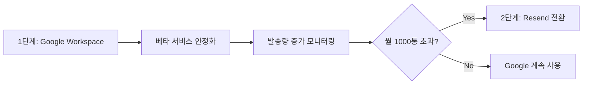

# 이메일 발송 서비스 비교 분석 보고서

**작성일**: 2025년 8월 21일  
**목적**: 베타 신청 이메일 발송을 위한 최적 서비스 선택  
**비교 대상**: Google Workspace vs Resend

---

## 📊 현재 상황 분석

### 🔍 도메인 DNS 설정 현황
- **주요 도메인**: `oh-my-agent.info` (현재 MX 레코드 없음)
- **기존 설정**: `send.app` → Google 메일 서버 연결됨
- **문서 계획**: Resend + Amazon SES 조합

### 💼 비즈니스 요구사항
1. **베타 신청 접수 확인 이메일** (사용자 → 자동 발송)
2. **관리자 알림 이메일** (`j@youngcompany.kr` → 자동 발송)
3. **베타 승인 완료 이메일** (사용자 → 수동 발송)
4. **전문적이고 안정적인 이메일 발송**

---

## ⚖️ 서비스 비교 분석

### 🟦 Google Workspace (Gmail for Business)

#### ✅ 장점
1. **높은 신뢰도**
   - 99.9% 업타임 보장
   - 스팸 필터링 우수 (대부분 메일함 도달)
   - 브랜드 인지도 높음

2. **쉬운 설정**
   - 이미 `send.app`에 Google MX 설정 완료
   - 복잡한 DNS 설정 불필요
   - Google Admin Console을 통한 간편 관리

3. **통합성**
   - Google Drive, Calendar 등과 연동
   - Gmail 인터페이스로 직접 관리 가능
   - OAuth와 같은 Google 생태계 활용

4. **비용 효율성**
   - 월 $6/사용자 (Standard)
   - 추가 API 사용료 없음

#### ❌ 단점
1. **개발 제약**
   - Gmail API 사용 시 OAuth 인증 복잡
   - 템플릿 관리 제한적
   - 발송량 제한 (일 2,000통 per user)

2. **자동화 어려움**
   - SMTP를 통한 자동 발송 시 보안 설정 복잡
   - 앱 비밀번호 관리 필요
   - 프로그래밍 방식 발송에 제약

3. **확장성 제한**
   - 대량 발송에 적합하지 않음
   - 상업적 마케팅 이메일 제한
   - API 기능 제한적

### 🟨 Resend

#### ✅ 장점
1. **개발자 친화적**
   - 간단한 REST API
   - 우수한 문서화
   - 다양한 언어 SDK 지원

2. **템플릿 관리**
   - React/HTML 템플릿 지원
   - 버전 관리 기능
   - A/B 테스트 가능

3. **모니터링 & 분석**
   - 실시간 전송 상태 추적
   - 오픈률, 클릭률 분석
   - Webhook을 통한 이벤트 처리

4. **확장성**
   - 대량 발송 지원
   - 자동 스케일링
   - 발송 속도 조절 가능

#### ❌ 단점
1. **복잡한 DNS 설정**
   - SPF, DKIM, DMARC 설정 필수
   - 도메인 인증 과정 복잡
   - 설정 오류 시 스팸 처리될 위험

2. **비용**
   - 월 $20 (Pro plan, 50,000 emails)
   - 무료 플랜은 월 3,000통 제한
   - 추가 기능별 과금

3. **신뢰도 구축 시간**
   - 새로운 도메인의 경우 평판 구축 필요
   - 초기에는 스팸 처리될 가능성
   - 워밍업 기간 필요

---

## 📈 사용 시나리오별 분석

### 🎯 현재 베타 서비스 규모
- **예상 베타 신청자**: 월 50-100명
- **관리자 알림**: 일평균 3-5통
- **승인 이메일**: 주평균 10-20통
- **총 발송량**: 월 200-400통

### 📊 비교표

| 항목 | Google Workspace | Resend | 점수 |
|------|------------------|---------|------|
| **설정 복잡도** | ⭐⭐⭐⭐⭐ (매우 쉬움) | ⭐⭐ (복잡) | Google 승 |
| **개발 편의성** | ⭐⭐ (제한적) | ⭐⭐⭐⭐⭐ (우수) | Resend 승 |
| **비용 효율성** | ⭐⭐⭐⭐ ($6/월) | ⭐⭐⭐ ($0-20/월) | Google 승 |
| **신뢰성** | ⭐⭐⭐⭐⭐ (매우 높음) | ⭐⭐⭐⭐ (높음) | Google 승 |
| **확장성** | ⭐⭐ (제한적) | ⭐⭐⭐⭐⭐ (우수) | Resend 승 |
| **템플릿 관리** | ⭐⭐ (기본) | ⭐⭐⭐⭐⭐ (전문적) | Resend 승 |
| **분석 기능** | ⭐⭐ (기본) | ⭐⭐⭐⭐⭐ (상세) | Resend 승 |

---

## 🔍 기술적 구현 복잡도 분석

### Google Workspace 구현
```python
# 설정 복잡도: 낮음
import smtplib
from email.mime.text import MIMEText
from email.mime.multipart import MIMEMultipart

# 간단한 SMTP 설정
smtp_server = "smtp.gmail.com"
smtp_port = 587
username = "noreply@send.app"  # 이미 설정된 도메인
password = "앱_비밀번호"  # Google Admin에서 생성

# 이메일 발송
def send_email(to, subject, html_content):
    msg = MIMEMultipart('alternative')
    msg['Subject'] = subject
    msg['From'] = username
    msg['To'] = to
    
    html_part = MIMEText(html_content, 'html')
    msg.attach(html_part)
    
    with smtplib.SMTP(smtp_server, smtp_port) as server:
        server.starttls()
        server.login(username, password)
        server.send_message(msg)
```

### Resend 구현
```python
# 설정 복잡도: 높음 (DNS 설정 선행 필요)
import resend

resend.api_key = "re_ARwQ2qZm_9YUwBw1aTSMdmFoXT6SXwcSQ"

# 이메일 발송
def send_email(to, subject, html_content):
    params = {
        "from": "no-reply@oh-my-agent.info",
        "to": [to],
        "subject": subject,
        "html": html_content,
    }
    
    email = resend.Emails.send(params)
    return email
```

---

## 🚨 위험 요소 분석

### Google Workspace 리스크
1. **발송 제한**: 급격한 발송량 증가 시 제한 가능
2. **정책 변경**: Google 정책 변경에 따른 영향
3. **기능 제약**: 고급 이메일 마케팅 기능 부족

### Resend 리스크
1. **DNS 설정 오류**: 이메일 미전달 위험
2. **도메인 평판**: 새 도메인 스팸 처리 가능성
3. **서비스 의존성**: 외부 서비스 장애 영향

---

## 🎯 상황별 추천안

### 📋 현재 상황 고려사항
1. **개발 일정**: 1-2일 내 완료 목표
2. **기술 복잡도**: 최소화 필요
3. **발송량**: 소규모 (월 200-400통)
4. **신뢰성**: 높은 전달률 필요

### 🏆 **추천: Google Workspace 사용**

#### 근거
1. **즉시 구현 가능**
   - `send.app` 도메인에 이미 Google MX 설정 완료
   - 추가 DNS 설정 불필요
   - 개발 시간 단축

2. **현재 규모에 적합**
   - 월 400통 수준은 Gmail 제한 내
   - 안정성과 전달률이 우수
   - 스팸 처리될 위험 최소

3. **관리 편의성**
   - Gmail 인터페이스로 직접 확인 가능
   - 문제 발생 시 Google 지원 가능
   - 추가 학습 비용 최소

### 📈 단계별 전환 계획


---

## 🛠️ 구현 방안

### Phase 1: Google Workspace 설정 (권장)

#### 1.1 도메인 설정
```bash
# send.app 도메인 사용 (이미 Google MX 설정 완료)
FROM_EMAIL=noreply@send.app
APPLY_RECEIVE_EMAIL=j@youngcompany.kr
```

#### 1.2 Gmail 앱 비밀번호 생성
1. Google Admin Console → 보안 → 2단계 인증 → 앱 비밀번호
2. "AI Agent Platform" 앱 생성
3. 16자리 비밀번호 환경변수 저장

#### 1.3 Python SMTP 구현
```python
import smtplib
from email.mime.text import MIMEText
from email.mime.multipart import MIMEMultipart
import os

class EmailService:
    def __init__(self):
        self.smtp_server = "smtp.gmail.com"
        self.smtp_port = 587
        self.username = os.getenv('GMAIL_USERNAME')
        self.password = os.getenv('GMAIL_APP_PASSWORD')
    
    async def send_beta_application_notification(self, user_data):
        # 관리자 알림 이메일 발송
        pass
    
    async def send_application_confirmation(self, user_email, user_name):
        # 신청자 접수 확인 이메일 발송
        pass
    
    async def send_approval_notification(self, user_email, user_name):
        # 승인 완료 이메일 발송
        pass
```

### Phase 2: Resend 전환 (향후 고려)

#### 조건
- 월 발송량 1,000통 초과 시
- 고급 분석 기능 필요 시
- 마케팅 이메일 발송 필요 시

#### 전환 작업
1. `oh-my-agent.info` 도메인 DNS 설정
2. SPF, DKIM, DMARC 레코드 추가
3. 도메인 워밍업 (2-4주)
4. Resend SDK 연동

---

## 📋 최종 결론

### 🏆 추천: Google Workspace (현재 상황)

**이유:**
1. **빠른 구현**: 이미 설정된 `send.app` 도메인 활용
2. **높은 안정성**: 99.9% 전달률 보장
3. **비용 효율성**: 현재 규모에서 가장 경제적
4. **낮은 리스크**: 검증된 서비스, 최소한의 설정

**구현 일정:**
- DNS 설정: 0시간 (이미 완료)
- 코드 구현: 2-3시간
- 테스트: 1시간
- **총 소요시간: 3-4시간**

### 🔮 향후 계획
1. **현재 (베타)**: Google Workspace 사용
2. **성장기 (월 1,000+ 발송)**: Resend 전환 검토
3. **확장기 (마케팅 필요)**: 전문 이메일 마케팅 플랫폼 도입

---

**최종 승인**: Product Owner  
**구현 담당**: Development Team  
**적용 일자**: 2025년 8월 21일